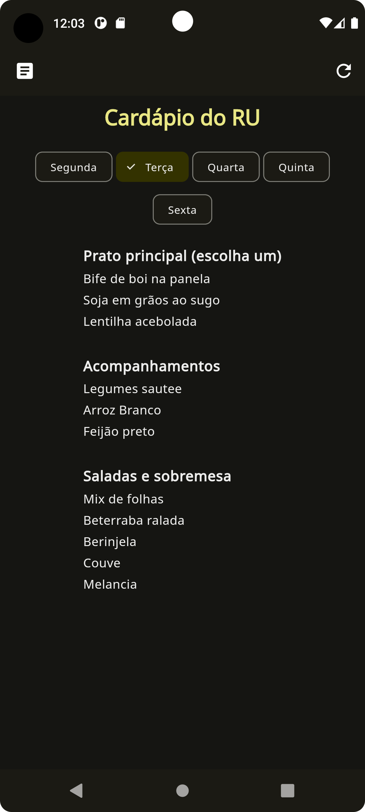
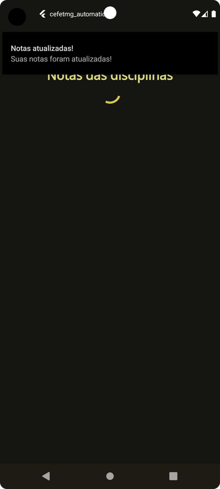
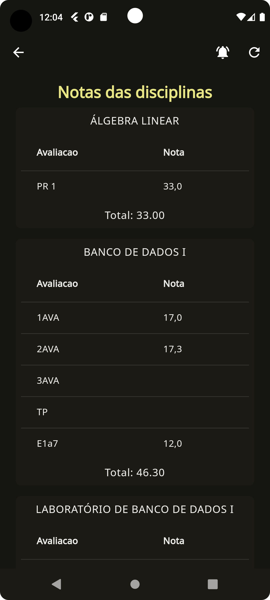

# Automação dos sistemas CEFETMG

Este é um projeto escrito em Flutter com o objetivo de facilitar o acesso de informações pertinentes do CEFETMG. Atualmente possuí a funcionalidade de listagem do cardápio dos campus I, II e VI e também a visualização das avaliações disponíveis no sistema acadêmico.

## Telas do aplicativo

Tela inicial de login:

Tela do cardápio:

Tela de avaliações, com exemplo de notificação:

  
  

